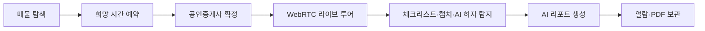
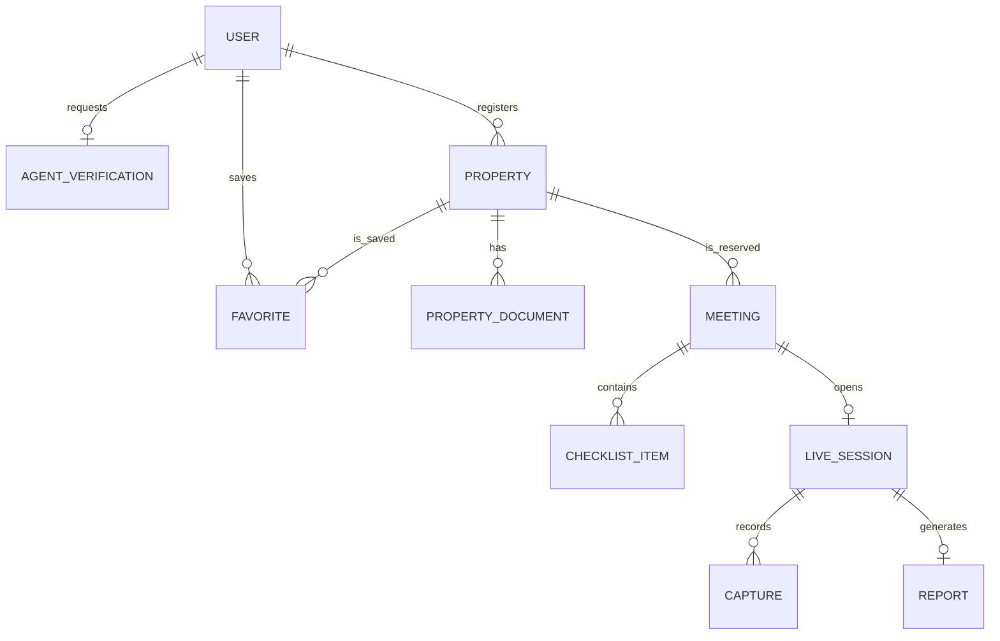

<p align="center">
  
</p>

<h1 align="center">방방봐 — 방을 방송으로 봐</h1>

<p align="center">
  
  
  
  
</p>


> 공인중개사와 실시간 화상으로 매물을 확인하고, 체크리스트와 AI 리포트로 기록을 남기는 비대면 부동산 투어 서비스

**방방봐**는 멀리 있는 집을 보기 위해 직접 이동해야 하는 불편과, 사진만으로는 매물의 실제 상태를 판단하기 어렵다는 문제에서 출발했습니다. 세입자는 검증된 공인중개사와 라이브 투어를 진행하고, 투어 중 확인한 내용과 AI 하자 탐지 결과를 하나의 리포트로 남길 수 있습니다.

---

## 📋 목차

- [프로젝트 소개](#-프로젝트-소개)
- [주요 기능](#-주요-기능)
- [사용자별 이용 흐름](#-사용자별-이용-흐름)
- [주요 화면](#-주요-화면)
- [시스템 아키텍처](#-시스템-아키텍처)
- [핵심 도메인 관계](#-핵심-도메인-관계)
- [핵심 기술](#-핵심-기술)
- [기술 스택](#-기술-스택)
- [프로젝트 구조](#-프로젝트-구조)
- [시작하기](#-시작하기)
- [관련 문서](#-관련-문서)
- [팀원](#-팀원)

---

## 🏡 프로젝트 소개

### 왜 방방봐인가요?

- 매물을 한 번 확인하기 위해 긴 거리를 왕복해야 합니다.
- 등록된 사진만으로는 채광, 소음, 수압, 곰팡이 같은 실제 상태를 알기 어렵습니다.
- 첫 계약자는 현장에서 무엇을 확인해야 하는지 놓치기 쉽습니다.
- 투어가 끝난 뒤에는 여러 매물의 장단점을 객관적으로 비교하기 어렵습니다.

방방봐는 이 과정을 **매물 탐색 → 투어 예약 → 실시간 확인 → 체크리스트 작성 → AI 리포트 보관**의 한 흐름으로 연결합니다.



| 구분          | 내용                                                               |
| ------------- | ------------------------------------------------------------------ |
| 프로젝트 기간 | 2026.07.15 ~ 2026.08.06                                            |
| 서비스 대상   | 원거리 매물을 확인하려는 세입자, 비대면 투어를 제공하는 공인중개사 |
| 핵심 가치     | 이동 비용 절감, 현장 정보의 투명성, 확인 기록의 구조화             |

---

## ✨ 주요 기능

### 1. 지도 기반 매물 탐색

- 지역, 거래 유형, 매물 유형, 가격 조건으로 원하는 매물을 검색합니다.
- Kakao Maps에서 매물의 위치와 주변 시설을 함께 확인합니다.
- 관심 있는 매물을 저장하고 마이페이지에서 다시 비교할 수 있습니다.

### 2. 검증된 공인중개사와 예약

- Kakao·Google OAuth로 간편하게 로그인합니다.
- 공인중개사는 자격 정보를 제출하고, 관리자 승인 후 매물을 등록·관리할 수 있습니다.
- 세입자는 최대 3개의 희망 시간을 제안하고, 중개사는 예약을 확정하거나 거절합니다.

### 3. WebRTC 실시간 비대면 투어

- 세입자와 중개사가 브라우저에서 실시간 영상·음성으로 연결됩니다.
- WebSocket이 시그널링을 담당하고, P2P 연결이 어려운 환경에서는 coturn이 미디어를 중계합니다.
- 투어 화면에서 체크리스트를 바로 갱신하고 필요한 장면을 캡처할 수 있습니다.

### 4. AI 하자 탐지와 캡처 검토

- 투어 영상 프레임을 AI 서버로 전송해 곰팡이, 균열 등 매물의 하자 후보를 탐지합니다.
- 탐지 결과는 캡처 이미지와 함께 저장되며, 세입자가 리포트 생성 전에 필요한 장면만 선별할 수 있습니다.
- RunPod 환경의 FastAPI·YOLO 추론 서버와 비동기로 연동합니다.

### 5. 체크리스트 기반 AI 리포트

- 체크리스트, 사용자 캡처, AI 탐지 결과를 하나의 리포트로 조합합니다.
- Claude가 투어 내용을 바탕으로 매물 총평을 생성합니다.
- 완성된 리포트는 웹에서 다시 확인하거나 PDF로 내려받을 수 있습니다.

### 6. 매물 서류 AI 분석

- 등기부등본과 건축물대장 등 매물 서류를 안전하게 업로드합니다.
- AI가 주요 항목과 위험 요소를 분석하고, 결과를 PDF로 제공합니다.
- 원본 파일은 공개 URL 대신 S3 객체 키로 관리하며 필요한 시점에만 제한적으로 접근합니다.

---

## 👥 사용자별 이용 흐름

| 세입자                              | 공인중개사                       | 관리자                |
| ----------------------------------- | -------------------------------- | --------------------- |
| 소셜 로그인                         | 소셜 로그인 및 중개사 인증 신청  | 중개사 인증 요청 검토 |
| 지도·필터로 매물 탐색               | 승인 후 매물·이미지·서류 등록    | 신청 승인 또는 반려   |
| 최대 3개의 희망 시간으로 예약 요청  | 요청 시간 확인 후 예약 확정·거절 | 서비스 운영 상태 확인 |
| 라이브 투어 참여 및 체크리스트 작성 | 현장에서 영상으로 매물 안내      |                       |
| 캡처 검토 후 AI 리포트 생성         | 완료된 예약 관리                 |                       |
| 리포트 열람·PDF 다운로드            |                                  |                       |

---

## 🖥️ 주요 화면

| 화면           | 경로                                      | 주요 기능                                    |
| -------------- | ----------------------------------------- | -------------------------------------------- |
| 랜딩           | `/`                                       | 서비스 소개, 매물 미리보기, 이용 흐름 안내   |
| 로그인         | `/login`                                  | Kakao·Google 소셜 로그인                     |
| 매물 목록      | `/properties`                             | 검색·필터, Kakao 지도, 매물 카드, 찜         |
| 매물 상세      | `/properties/:id`                         | 매물·중개사·주변 시설·서류 정보, 예약 진입   |
| 매물 등록·수정 | `/properties/new`, `/properties/:id/edit` | 중개사 매물 정보·이미지 관리                 |
| 관심 매물      | `/saved`                                  | 찜한 매물 목록 조회·비교                     |
| 예약 신청      | `/booking/:id`                            | 1~3순위 희망 시간 선택 및 예약 요청          |
| 예약 관리      | `/reservations`                           | 보낸·받은 예약의 상태 확인과 확정·거절·취소  |
| 라이브 투어    | `/reservation/:slug`                      | WebRTC 화상 통화, 체크리스트, 캡처, AI 탐지  |
| 캡처 검토      | `/sessions/:sessionId/captures/review`    | 리포트에 포함할 캡처와 탐지 결과 선별        |
| 리포트         | `/reports/:reportId`                      | 체크리스트·하자·AI 총평 확인 및 PDF 다운로드 |
| 마이페이지     | `/mypage`                                 | 프로필, 중개사 인증, 등록 매물, 리포트 관리  |
| 관리자         | `/admin`                                  | 공인중개사 인증 신청 검토                    |

---

## 🏗️ 시스템 아키텍처


- React 클라이언트는 Spring Boot REST API 및 WebSocket 시그널링 서버와 통신합니다.
- 세입자와 중개사의 영상·음성은 WebRTC로 직접 전달되며, 연결이 어려울 때 coturn이 중계합니다.
- 영상 프레임은 RunPod의 FastAPI·YOLO 서버에서 분석하고 탐지 결과를 백엔드에 저장합니다.
- PostgreSQL은 서비스 데이터를, Amazon S3는 매물 이미지·서류·캡처·PDF를 관리합니다.
- Kakao Maps, Kakao·Google OAuth, Claude API를 외부 서비스로 연동합니다.

---

## 🧩 핵심 도메인 관계

> 아래 다이어그램은 현재 프론트엔드의 API 계약을 기준으로 정리한 **개념 관계도**입니다. 전체 DB 컬럼을 표현하는 물리 ERD는 아닙니다.



---

## 🔑 핵심 기술

### WebRTC 연결과 세션 제어

1. 예약이 확정되면 서버가 RTC 세션과 입장 정보를 발급합니다.
2. 클라이언트는 제한 시간의 시그널링 토큰으로 WebSocket에 연결합니다.
3. SDP와 ICE candidate를 교환해 세입자와 중개사 간 P2P 연결을 구성합니다.
4. STUN만으로 연결할 수 없는 CGNAT·대칭 NAT 환경에서는 coturn의 UDP/TCP relay 후보를 사용합니다.
5. 세션 입장·퇴장·종료 상태를 서버에서 관리해 중복 입장과 만료 세션을 제어합니다.

### 실시간 AI 하자 탐지

1. 라이브 영상에서 분석할 프레임을 추출합니다.
2. 프론트엔드가 프레임과 세션 정보를 AI 서버로 전송합니다.
3. YOLO 모델이 하자 후보와 위치를 탐지합니다.
4. 탐지 결과와 캡처 이미지를 백엔드가 영속화하고 리포트 생성 데이터로 연결합니다.

### 비동기 AI 리포트 생성

1. 미팅 종료 후 선별된 캡처, 하자 결과, 체크리스트를 취합합니다.
2. 이벤트 기반 비동기 처리로 리포트 생성 요청과 API 응답을 분리합니다.
3. Claude가 구조화된 투어 정보와 캡처를 바탕으로 총평을 작성합니다.
4. HTML을 PDF로 변환해 S3에 저장하고, 사용자는 생성 상태를 조회한 뒤 결과를 내려받습니다.

### 민감 문서 보호

- 매물 서류와 중개사 증빙 파일은 서버를 통해 S3에 저장합니다.
- DB에는 공개 URL이 아닌 객체 키를 보관합니다.
- 조회·분석 시점에만 만료 시간이 있는 Presigned URL을 발급합니다.

---

## 🛠️ 기술 스택

| 영역               | 기술                                                                   |
| ------------------ | ---------------------------------------------------------------------- |
| Frontend           | React 19, TypeScript 5, Vite 8, React Router 7                         |
| State & Data       | TanStack Query 5, Zustand, Axios                                       |
| UI                 | Tailwind CSS 4, Radix UI, Framer Motion, Lucide React                  |
| Backend            | Java 21, Spring Boot 4.1, Spring MVC, Spring Security, Spring Data JPA |
| Realtime           | WebRTC, WebSocket signaling, STUN/TURN, coturn                         |
| AI                 | FastAPI, YOLO, RunPod, Anthropic Claude Sonnet 4.6                     |
| Database & Storage | PostgreSQL, Amazon S3                                                  |
| Auth & Map         | JWT, Kakao OAuth, Google OAuth, Kakao Maps/Local API                   |
| Infra              | AWS EC2, Docker, Nginx, Gradle, pnpm                                   |
| Documentation      | Markdown, Pencil design, 포팅 매뉴얼                                   |

---

## 📁 프로젝트 구조

```text
S15P11A504/
├── frontend/                  # React SPA
│   ├── public/                # 로고, 영상, 지도 마커 등 정적 자원
│   └── src/
│       ├── api/               # 도메인별 API 모듈
│       ├── components/        # 공통·도메인 UI 컴포넌트
│       ├── hooks/             # WebRTC·조회·반응형 훅
│       ├── lib/               # 인증, 지도, 포맷, 세션 유틸
│       ├── pages/             # 라우트 단위 페이지
│       └── stores/            # Zustand 전역 상태
├── backend/                   # Java 21·Spring Boot 애플리케이션
│   └── src/main/              # 애플리케이션 소스와 설정
├── infra/coturn/              # TURN 서버 설정과 설치 스크립트
└── exec/                      # 배포·포팅 매뉴얼
```

프론트엔드 API 모듈은 `auth`, `user`, `agentVerification`, `property`, `favorite`, `meeting`, `session`, `checklist`, `inspection`, `report`, `propertyDocument`, `admin`으로 분리되어 있습니다.

---

## 🚀 시작하기

### 요구 사항

- Node.js 24+
- pnpm 11+
- Java 21 (백엔드 실행 시)
- Docker 및 Docker Compose (배포·TURN 서버 실행 시)

### 1. 저장소 준비

```bash
git clone https://github.com/Jinoko01/bangbangbwa.git S15P11A504
cd S15P11A504
```

### 2. 프론트엔드 환경 변수

`frontend/.env.example`을 `frontend/.env`로 복사한 뒤, 사용할 기능에 맞게 아래 값을 추가합니다. `VITE_*` 값은 빌드 결과에 포함되므로 비밀 키를 저장하면 안 됩니다.

```dotenv
VITE_API_BASE_URL=http://localhost:8080
VITE_AI_BASE_URL=
VITE_KAKAO_KEY=
VITE_KAKAO_CLIENT_ID=
VITE_GOOGLE_CLIENT_ID=
VITE_TURN_URLS=turn:your-turn-server:3478?transport=udp,turn:your-turn-server:3478?transport=tcp
VITE_TURN_USERNAME=
VITE_TURN_CREDENTIAL=
```

```bash
cd frontend
pnpm install
pnpm dev
```

`http://localhost:5173`에서 프론트엔드를 확인할 수 있습니다. 개발 서버에는 방당 2명을 중계하는 WebRTC 시그널링 서버가 포함됩니다.

### 3. 백엔드 실행

현재 checkout의 `backend` 디렉터리는 Spring Boot 기본 애플리케이션과 의존성을 포함합니다. 통합 API를 사용하려면 datasource, OAuth, storage 등의 Spring 설정을 실행 환경에 맞게 주입해야 합니다.

```bash
cd backend
./gradlew bootRun          # Windows: gradlew.bat bootRun
```

### 4. 빌드와 테스트

```bash
# frontend
cd frontend
pnpm lint
pnpm build

# backend
cd backend
./gradlew test             # Windows: gradlew.bat test
```

> OAuth 콜백은 `https://<frontend-host>/oauth/callback/{kakao|google}` 형식으로, Kakao·Google 콘솔 등록값과 정확히 일치해야 합니다.

### 5. 배포용 컨테이너

`frontend/docker-compose.yml`은 정적 프론트엔드를 서빙하는 Nginx와 coturn을 함께 실행합니다. coturn은 Linux 호스트 네트워크를 사용하므로 배포 서버에서 실행하는 구성입니다.

```bash
cd frontend
docker compose up -d --build
```

---

## 📖 관련 문서

- [배포·포팅 매뉴얼](exec/porting-manual.md)
- [TURN 서버 구성](infra/coturn/README.md)
- [프론트엔드 API 연동 가이드](frontend/docs/api-guide.md)
- [프론트엔드 기능 명세](frontend/docs/frontend-spec.md)

---

## 🧑‍💻 팀원

| 이름   | 담당     | Git             |
| ------ | -------- | --------------- |
| 윤소윤 | Backend  | `kingwhangzang` |
| 최열음 | Backend  | `choiym0804`    |
| 서보영 | Backend  | `danna0326`     |
| 김재영 | Frontend | `dfizae`        |
| 황용진 | Frontend | `Jinoko01`      |
| 박성연 | Frontend | `tjddus`        |
